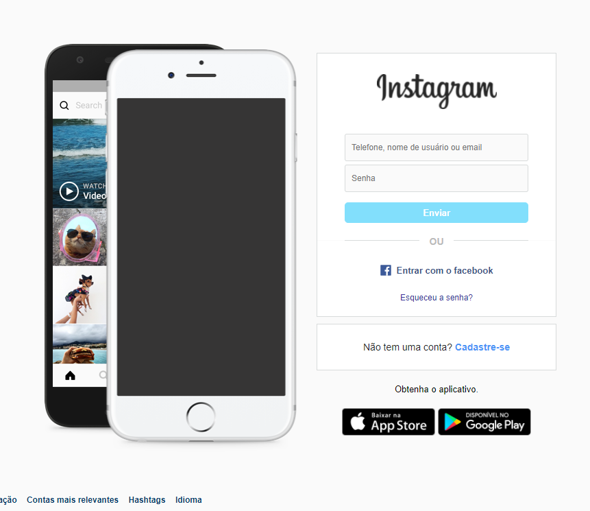
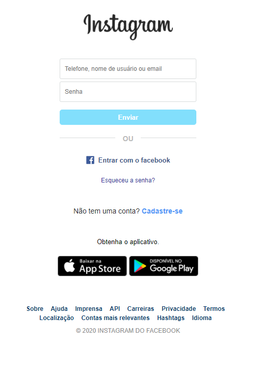

# PJ - Login Instagram
Este projeto se trata de um clone da tela de login do Instagram. Este projeto está contido no curso HTML e CSS: Técnicas Avançadas, provido pelo Matheus Baptisti. O curso está disponível da Udemy.

## Sobre o projeto
 Este projeto tem como objeto de estdo a técncica Flex Box. As imagens foram tiradas diretamente do site clonado. Não existe funcionalidade de back-end, apenas front. O projeto está totalmente responsivo
 
 ### Capturas de tela
Desktop: 

Mobile: 

## Acessar o site
Caso queira ver o site em funcionamento, sem precisar baixar o código, basta clicar [aqui](https://joaopedrosassi.github.io/PJ-Login_Instagram--HTML_CSS_TecAdv/)
